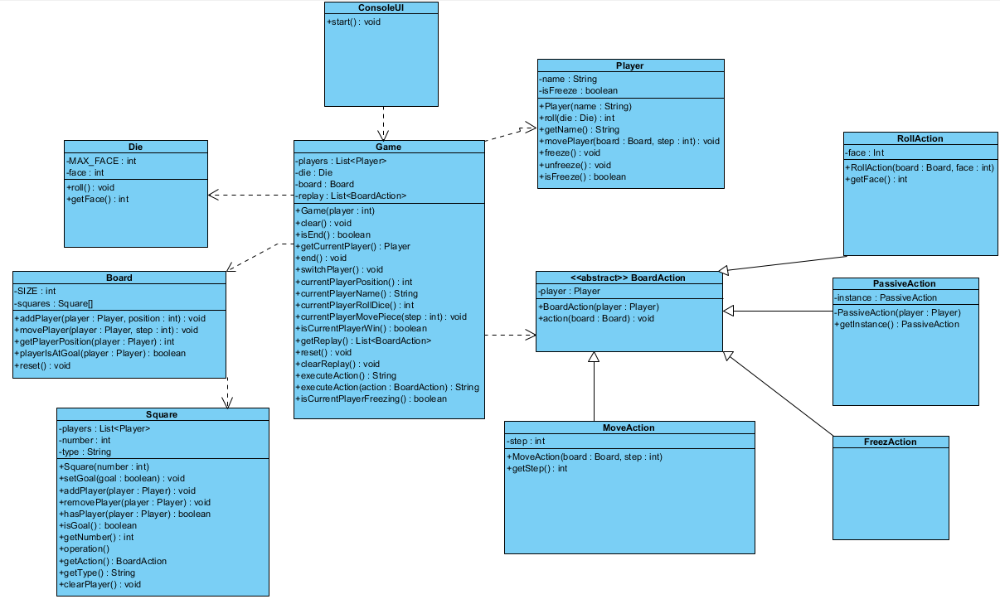
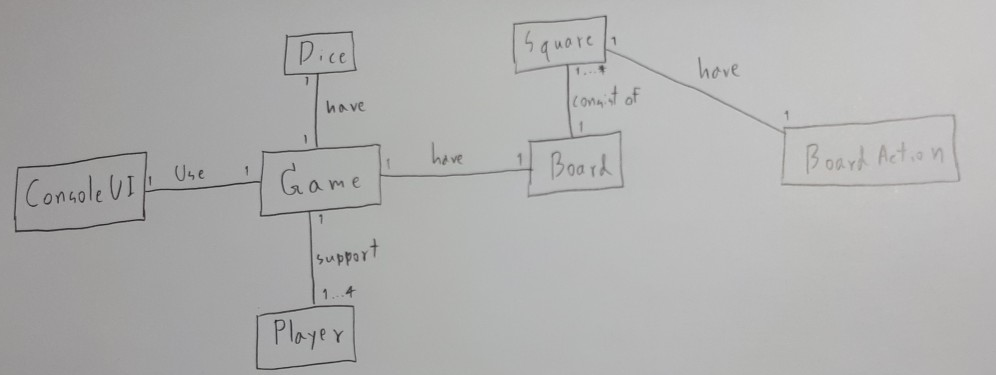

# Snake & Ladder Game
by 
* Nitith Chayakul 5910545736
* Patiphan Srisook 5910546422
* Pittayut Sothanakul 5910546678

## Installation
You can download the lastest version [__HERE__](https://github.com/napnie/Snake-Ladder-Final/releases)

## Docs

### UML

### Domain Model

## Work left
* ~~Replay~~
* ~~Backward square~~
* ~~Freeze square~~
* ~~Player get extra turn if rolled 6~~
* ~~Restart the game~~
* ~~Select number of player~~
* ~~Ladder square~~
* ~~Snake square~~
* ~~UI~~
* ~~UML (need update)~~
* ~~Domain Model~~

[Project Requirement](https://github.com/KeeUka/SSD_2018_Final)
